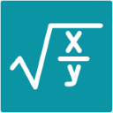



# Math Expression Evaluator in .NET

NuGet packages:

- MathEvaluator  
- MathEvaluator.FastExpressionCompiler  

MathEvaluator is a .NET library that allows you to evaluate and compile any mathematical expressions from a string dynamically.

## Features
- Supports different mathematical contexts, such as scientific, programming, and other custom contexts.
- Evaluates Boolean logic, as well as Double, Decimal, and Complex numbers.
- Compiles a math expression string into executable code and produces a delegate that represents the math expression.
- Provides variable support within math expressions (including expression-defined variables).
- Extensible with custom functions and operators.
- Fast and comprehensive. More than 4000 tests are passed, including complex math expressions (for example, -3^4sin(-π/2) or sin-3/cos1).

## Articles
[Evaluating Boolean logical expressions.](https://medium.com/@AntonAntonov88/evaluate-boolean-expression-from-string-in-c-net-af80e08453ea)

## Perfomance
This math expression evaluator is designed for exceptional performance by leveraging modern .NET features and best practices, which is why it targets .NET Standard 2.1 or higher. 

This high-performance evaluator stands out due to its use of `ReadOnlySpan<char>`, and avoidance of regular expressions. These design choices collectively ensure minimal memory allocation, fast parsing, and efficient execution.

The evaluator uses recursive method calls to handle mathematical operations based on operator precedence and rules, an operator with highest precedence is evaluating first. This approach avoids the overhead associated with stack or queue data structures.

The evaluator uses a prefix tree, also known as a trie (pronounced "try"), for efficient searching of variables, operators, and functions by their keys (names) when providing a specific mathematical context or adding custom variables, operators, and functions is required.

Let's compare, for example, performance of calculating the mathematical expression:

    22888.32 * 30 / 323.34 / .5 - -1 / (2 + 22888.32) * 4 - 6

Below are the results of the comparison with the NCalc library: 

| Method        | Job      | Runtime  | Mean       | Error    | StdDev   | Gen0   | Allocated |
|-------------- |--------- |--------- |-----------:|---------:|---------:|-------:|----------:|
| MathEvaluator | .NET 8.0 | .NET 8.0 |   643.2 ns |  1.83 ns |  1.43 ns | 0.0086 |     112 B |
| NCalc         | .NET 8.0 | .NET 8.0 | 5,949.3 ns | 16.69 ns | 13.93 ns | 0.3586 |    4504 B |
| MathEvaluator | .NET 9.0 | .NET 9.0 |   563.9 ns |  1.63 ns |  1.45 ns | 0.0086 |     112 B |
| NCalc         | .NET 9.0 | .NET 9.0 | 5,249.5 ns | 15.79 ns | 14.00 ns | 0.3586 |    4504 B |

***NOTE:** If the evaluation results depend on variable values. In such cases, compilation is a better alternative.*

## Compilation
Added in version [2.0.0](https://github.com/AntonovAnton/math.evaluation/releases/tag/2.0.0)

By using compilation, you can convert any mathematical expression string into a delegate, such as `Func<T, TResult>` or `Func<TResult>`, which significantly improves performance when evaluating the expression. 
However, since compilation takes additional time, and MathEvaluator already provides fast evaluation, it is recommended to compile the expression only if you plan to evaluate it repeatedly, particularly for 150 or more iterations. For detailed performance insights, refer to the [benchmarks](https://github.com/AntonovAnton/math.evaluation/tree/main/BenchmarkDotNet.Artifacts/results).

The compiled delegate can be executed with different parameters, allowing you to pass variables and functions as arguments. This feature is particularly useful for scenarios where the same expression needs to be evaluated with different variable values or functions.

In version [2.3.0](https://github.com/AntonovAnton/math.evaluation/releases/tag/2.3.0) you can also use a `Dictionary<string, TResult>` as a parameter. This allows you to pass variables and their values in a more flexible way, especially when working with dynamic inputs or when the structure of input parameters is not known in advance.

In version [2.3.1](https://github.com/AntonovAnton/math.evaluation/releases/tag/2.3.1) added `IExpressionCompiler` interface, which allows you to inject your own compiler. This is useful if you want to use a different compiler or if you want to customize the compilation process in some way.

**MathEvaluator.FastExpressionCompiler** is an extension of the MathEvaluator library that uses the [FastExpressionCompiler](https://github.com/dadhi/FastExpressionCompiler) to provide performance improvements of up to 10-40x compared to the built-in .NET `LambdaExpression.Compile()` method.  

This library includes all features of the MathEvaluator library but adds a dependency on FastExpressionCompiler. For more details, refer to the [documentation](https://github.com/AntonovAnton/math.evaluation/tree/main/MathEvaluation.FastExpressionCompiler).

## How to use
Examples of using string extentions:

    "22888.32 * 30 / 323.34 / .5 - -1 / (2 + 22888.32) * 4 - 6".Evaluate();

    "22888.32 * 30 / 323.34 / .5 - -1 / (2 + 22888.32) * 4 - 6".EvaluateDecimal();

    "$22,888.32 * 30 / 323.34 / .5 - - 1 / (2 + $22,888.32) * 4 - 6".Evaluate(null, new CultureInfo("en-US"));

    "22’888.32 CHF * 30 / 323.34 / .5 - - 1 / (2 + 22’888.32 CHF) * 4 - 6".EvaluateDecimal(null, new CultureInfo("de-CH"));

    "ln(1/-0.5 + √(1/(0.5^2) + 1))".Evaluate(new ScientificMathContext());
    
    "P * (1 + r/n)^d".EvaluateDecimal(new { P = 10000, r = 0.05, n = 365, d = 31 }, new DecimalScientificMathContext());
    
    "4 % 3".Evaluate(new ProgrammingMathContext());
    
    "4 mod 3".Evaluate(new ScientificMathContext());

    "4 <> 4 OR 5.4 = 5.4 AND NOT 0 < 1 XOR 1.0 - 1.95 * 2 >= -12.9 + 0.1 / 0.01".EvaluateBoolean(new ProgrammingMathContext());

    "¬⊥∧⊤∨¬⊤⇒¬⊤".EvaluateBoolean(new ScientificMathContext());
    
    "sin(2 + 3i) * arctan(4i)/(1 - 6i)".EvaluateComplex(new ComplexScientificMathContext());

Examples of using an instance of the MathExpression class:
        
    new MathExpression("22888.32 * 30 / 323.34 / .5 - -1 / (2 + 22888.32) * 4 - 6").Evaluate();

    new MathExpression("22888.32 * 30 / 323.34 / .5 - -1 / (2 + 22888.32) * 4 - 6").EvaluateDecimal();

    new MathExpression("$22,888.32 * 30 / 323.34 / .5 - - 1 / (2 + $22,888.32) * 4 - 6", null, new CultureInfo("en-US")).Evaluate();

    new MathExpression("22’888.32 CHF * 30 / 323.34 / .5 - - 1 / (2 + 22’888.32 CHF) * 4 - 6", null, new CultureInfo("de-CH")).EvaluateDecimal();
    
    new MathExpression("ln(1/-0.5 + √(1/(0.5^2) + 1))", new ScientificMathContext()).Evaluate();

    new MathExpression("P * (1 + r/n)^d", new DecimalScientificMathContext()).EvaluateDecimal(new { P = 10000, r = 0.05, n = 365, d = 31 });
    
    new MathExpression("4 % 3", new ProgrammingMathContext()).Evaluate();
    
    new MathExpression("4 mod 3", new ScientificMathContext()).Evaluate();

    new MathExpression("4 <> 4 OR 5.4 = 5.4 AND NOT 0 < 1 XOR 1.0 - 1.95 * 2 >= -12.9 + 0.1 / 0.01", new ProgrammingMathContext()).EvaluateBoolean();

    new MathExpression("¬⊥∧⊤∨¬⊤⇒¬⊤", new ScientificMathContext()).EvaluateBoolean();
    
    new MathExpression("sin(2 + 3i) * arctan(4i)/(1 - 6i)", new ComplexScientificMathContext()).EvaluateComplex();

Examples of passing custom variables and functions as parameters (Support expression-defined variables added in version [2.4.0](https://github.com/AntonovAnton/math.evaluation/releases/tag/2.4.0)):

    var x1 = 0.5;
    var x2 = -0.5;
    var y = "x1 * x2"; // expression-defined variable
    var sqrt = Math.Sqrt;
    Func<double, double> ln = Math.Log;

    var value1 = "ln(1/-x1 + sqrt(1/(x2*x2) + 1)) + y"
        .Evaluate(new { x1, x2, y, sqrt, ln });

    var parameters = new MathParameters();
    parameters.BindVariable(x1);
    parameters.BindVariable(x2);
    parameters.BindExpressionVariable(y); // expression-defined variable
    parameters.BindFunction(sqrt);
    parameters.BindFunction(d => Math.Log(d), "ln");

    var value2 = "ln(1/-x1 + sqrt(1/(x2*x2) + 1)) + y"
        .Evaluate(parameters);

Example of using custom context:

    var context = new MathContext();
    context.BindFunction(Math.Sqrt);
    context.BindFunction(d => Math.Log(d), "ln");
    context.BindExpressionVariable("x1 * x2", "y"); // expression-defined variable

    var value = "ln(1/-x1 + Math.Sqrt(1/(x2*x2) + 1)) + y"
        .Evaluate(new { x1 = 0.5, x2 = -0.5 }, context);
    
Example of evaluating C# expression:

    var value = "-2 * Math.Log(1/0.5f + Math.Sqrt(1/Math.Pow(0.5d, 2) + 1L))"
        .Evaluate(new DotNetStandardMathContext());

Example of compilation with an object as a parameter:

    var fn = "ln(1/x1 + √(1/(x2*x2) + 1))"
        .Compile(new { x1 = 0.0, x2 = 0.0 }, new ScientificMathContext());
        
    var value = fn(new { x1 = -0.5, x2 = 0.5 });

Example of compilation with a Dictionary as a parameter (Added in version [2.3.0](https://github.com/AntonovAnton/math.evaluation/releases/tag/2.3.0)):

    var dict = new Dictionary<string, double>();
    dict.Add("x1", 3.0);
    dict.Add("x2", 2.0);

    var fn = "x1 + Math.Sin(x2) * 0.5"
        .Compile(dict, new DotNetStandardMathContext());

    var value = fn(dict);

    dict.Clear();
    dict.Add("x1", 3.0);
    dict.Add("x3", 2.0);
    dict.Add("x4", 4.0);

    fn = "x1 + Math.Sin(x3) * Math.Cos(x4)"
        .Compile(dict, new DotNetStandardMathContext());

## How to debug or log

Added in version [2.1.0](https://github.com/AntonovAnton/math.evaluation/releases/tag/2.1.0)

By using the Evaluating event, you can debug or log the steps of a math expression's evaluation. This event is triggered at each step during the evaluation process. The following code demonstrates how to use to this event:

    using var expression = new MathExpression("-3^4sin(-PI/2)", new ScientificMathContext());

    expression.Evaluating += (object? sender, EvaluatingEventArgs args) =>
    {
        Console.WriteLine("{0}: {1} = {2};{3}",
            args.Step,
            args.MathString[args.Start..(args.End + 1)],
            args.Value,
            args.IsCompleted ? " //completed" : string.Empty);
    };
    
    var value = expression.Evaluate();

Output:

    1: 3^4 = 81;
    2: PI = 3.141592653589793;
    3: PI/2 = 1.5707963267948966;
    4: -PI/2 = -1.5707963267948966;
    5: sin(-PI/2) = -1;
    6: 3^4sin(-PI/2) = -81;
    7: -3^4sin(-PI/2) = 81; //completed

***NOTE**: To prevent memory leaks, it’s important to unsubscribe from the event after subscribing to it. The Evaluating event is cleaned up in the Dispose method, so I recommend using the **using** statement to ensure proper disposal and efficient resource management.*

## Complex numbers

Added in version [2.2.0](https://github.com/AntonovAnton/math.evaluation/releases/tag/2.2.0)

Complex numbers are written in the form **a ± bi**, where **a** is the real part and **bi** is the imaginary part. 
In mathematical expressions involving complex numbers, it's advisable to use parentheses () to ensure clarity and obtain the expected result.

## Supported math functions, operators, and constants

#### When no mathematical context is specified:
|          | Notation | Precedence |
|--------- |--------- | --------- |
| Addition | + | 0 |
| Subtraction, Negativity | - | 0 |
| Multiplication  | * | 100 |
| Division  | / | 100 |
| Parentheses  | ( ) | 200 |
| Currency symbol  | depends on culture info | |

#### Programming Math Context (using ProgrammingMathContext class):
|          | Notation | Precedence |
|--------- |--------- |--------- |
| Addition | + | 0 |
| Subtraction, Negativity | - | 0 |
| Multiplication  | * | 100 |
| Division  | / | 100 |
| Parentheses  | ( ) | 200 |
| Currency symbol  | depends on culture info | |
| Exponentiation | ** | 400 |
| Modulus | % | 100 |
| Floor Division  | // | 100 |
| Logical constants  | true, false, True, False, TRUE, FALSE | 300 |
| Equality  | = | -100 |
| Inequality  | \<> | -100 |
| Less than  | \< | -100 |
| Greater than  | > | -100 |
| Less than or equal  | \<= | -100 |
| Greater than or equal  | >= | -100 |
| Logical negation  | not, Not, NOT | -200 |
| Logical AND  | and, And, AND | -300 |
| Logical exclusive OR  | xor, Xor, XOR | -400 |
| Logical OR  | or, Or, OR | -500 |
| Conditional operation: `IIF(condition, valueIfTrue, valueIfFalse)`, where the `valueIfTrue` and `valueIfFalse` args are optional | iif, Iif, IIF | 200 |

#### Scientific Math Context (using ScientificMathContext class):

|          | Notation | Precedence |
|--------- |--------- | --------- |
| Addition | + | 0 |
| Subtraction, Negativity | - | 0 |
| Multiplication  | *, ×, or · | 100 |
| Division  | / or ÷ | 100 |
| Parentheses | ( ) | 200 |
| Currency symbol  | depends on culture info | |
| Exponentiation | ^ | 400 |
| Modulus | mod, Mod, MOD, modulo, Modulo, or MODULO | 100 |
| Floor Division  | // | 100 |
| Absolute  | \| \|, abs, Abs, ABS | 200 |
| Ceiling | ⌈ ⌉, ceil, Ceil, CEIL | 200 |
| Floor | ⌊ ⌋, floor, Floor, FLOOR | 200 |
| Square root | √, sqrt, Sqrt, SQRT | 200 |
| Cube root | ∛, cbrt, Cbrt, CBRT | 200 |
| Fourth root | ∜ | 200 |
| Natural logarithmic base | e | 300 |
| Natural logarithm | ln, Ln, LN | 200 |
| Common logarithm (base 10) | log, Log, LOG | 200 |
| Factorial | ! | 500 |
| Infinity | ∞ | 300 |
| Logical constants  | true, false, True, False, TRUE, FALSE, T, F, ⊤, ⊥ | 300 |
| Equality  | = | -100 |
| Inequality  | ≠ | -100 |
| Less than  | \< | -100 |
| Greater than  | > | -100 |
| Less than or equal  | ≤, ⪯ | -100 |
| Greater than or equal  | ≥, ⪰ | -100 |
| Logical negation  | ¬, not, Not, NOT | 500 for ¬, -200 |
| Logical AND  | ∧, and, And, AND | -300 |
| Logical exclusive OR  | ⊕, xor, Xor, XOR | -400 |
| Logical OR  | ∨, or, Or, OR | -500 |
| Logical implication  | →, ⇒, ←, ⟸ | -800 |
| Logical biconditional equivalence  | ↔, ⇔ | -900 |
| Logical biconditional inequivalence  | ↮, ⇎ | -900 |
| Logical equivalence  | ≡ | -1000 |
| Logical inequivalence  | ≢ | -1000 |
| Degrees to radians | °, rad, Rad, RAD | 500 for °, 200 |
| Radians to degrees | deg, Deg, DEG | 200 |
| Pi constant | π, pi, Pi, PI | 300 |
| Tau constant | τ | 300 |
| Sine | sin, Sin, SIN | 200 |
| Cosine | cos, Cos, COS | 200 |
| Tangent | tan, Tan, TAN | 200 |
| Secant | sec, Sec, SEC | 200 |
| Cosecant | csc, Csc, CSC | 200 |
| Cotangent | cot, Cot, COT | 200 |
| Hyperbolic sine | sinh, Sinh, SINH | 200 |
| Hyperbolic cosine | cosh, Cosh, COSH | 200 |
| Hyperbolic tangent | tanh, Tanh, TANH | 200 |
| Hyperbolic secant | sech, Sech, SECH | 200 |
| Hyperbolic cosecant | csch, Csch, CSCH | 200 |
| Hyperbolic cotangent | coth, Coth, COTH | 200 |
| Inverse sine | asin, Asin, ASIN, arcsin, Arcsin, ARCSIN, sin\^-1, Sin\^-1, SIN\^-1 | 200 |
| Inverse cosine | acos, Acos, ACOS, arccos, Arccos, ARCCOS, cos\^-1, Cos\^-1, COS\^-1 | 200 |
| Inverse tangent | atan, Atan, ATAN, arctan, Arctan, ARCTAN, tan\^-1, Tan\^-1, TAN\^-1 | 200 |
| Inverse secant | asec, Asec, ASEC, arcsec, Arcsec, ARCSEC, sec\^-1, Sec\^-1, SEC\^-1 | 200 |
| Inverse cosecant | acsc, Acsc, ACSC, arccsc, Arccsc, ARCCSC, csc\^-1, Csc\^-1, CSC\^-1 | 200 |
| Inverse cotangent | acot, Acot, ACOT, arccot, Arccot, ARCCOT, cot\^-1, Cot\^-1, COT\^-1 | 200 |
| Inverse Hyperbolic sine | asinh, Asinh, ASINH, arsinh, Arsinh, ARSINH, sinh\^-1, Sinh\^-1, SINH\^-1 | 200 |
| Inverse Hyperbolic cosine | acosh, Acosh, ACOSH, arcosh, Arcosh, ARCOSH, cosh\^-1, Cosh\^-1, COSH\^-1 | 200 |
| Inverse Hyperbolic tangent | atanh, Atanh, ATANH, artanh, Artanh, ARTANH, tanh\^-1, Tanh\^-1, TANH\^-1 | 200 |
| Inverse Hyperbolic secant | asech, Asech, ASECH, arsech, Arsech, ARSECH, sech\^-1, Sech\^-1, SECH\^-1 | 200 |
| Inverse Hyperbolic cosecant | acsch, Acsch, ACSCH, arcsch, Arcsch, ARCSCH, csch\^-1, Csch\^-1, CSCH\^-1 | 200 |
| Inverse Hyperbolic cotangent | acoth, Acoth, ACOTH, arcoth, Arcoth, ARCOTH, coth\^-1, Coth\^-1, COTH\^-1 | 200 |

#### How to evaluate a C# math expression string
DotNetStandardMathContext is the .NET Standard 2.1 programming math context supports all constants and functions provided by the System.Math and System.Numerics.Complex class, and supports equlity, comparision, logical boolean operators.

## Contributing
Contributions are welcome! Please fork the repository and submit pull requests for any enhancements or bug fixes.
If you enjoy my work and find it valuable, please consider becoming my [sponsor on GitHub](https://github.com/sponsors/AntonovAnton). Your support will enable me to share more open-source code. Together, we can make a positive impact in the developer community!

Looking to localize your project? Check out [l10n.dev](https://l10n.dev), an AI-powered localization service. [Translate JSON](https://l10n.dev/ws/translate-json) files while preserving format, keys, and placeholders. Supports 165 languages with an easy-to-use API and UI. Get started for free!

## License
This project is licensed under the Apache License, Version 2.0 - see the [LICENSE](https://github.com/AntonovAnton/math.evaluation?tab=License-1-ov-file) file for details.

## Contact
If you have any questions or suggestions, feel free to open an issue or contact me directly.
